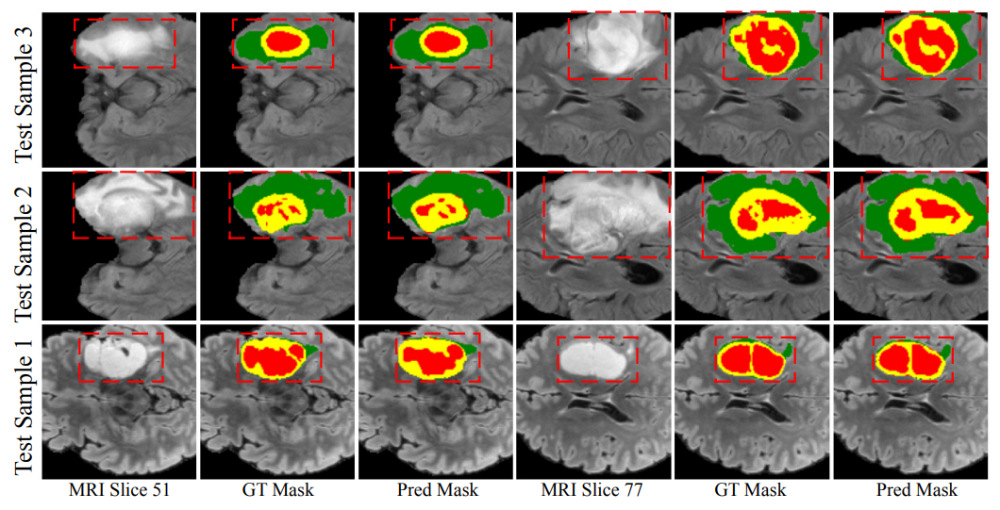

## Attention-Guided Vector Quantized Variational Autoencoder for Brain Tumor Segmentation

An Attention-Guided Vector Quantized Variational Autoencoder (AG-VQ-VAE) — a two-stage network specifically designed for boundary-focused tumor segmentation. Stage 1 comprises a VQ-VAE which learns a compact, discrete latent representation of segmentation masks. In stage 2, a conditional network extracts contextual features from MRI scans and aligns them with discrete mask embeddings to facilitate precise structural correspondence and improved segmentation fidelity.

## 🧠 Model Architecture


## 📈 Results on BraTS 2021

Comparison across three tumor subregions: **Whole Tumor (WT)**, **Tumor Core (TC)**, and **Enhancing Tumor (ET)**.  
**Best results are highlighted in bold.**

| Method             | HD95 ↓ WT | HD95 ↓ TC | HD95 ↓ ET | HD95 ↓ AVG | Dice ↑ WT | Dice ↑ TC | Dice ↑ ET | Dice ↑ AVG |
|--------------------|:---------:|:---------:|:---------:|:----------:|:---------:|:---------:|:---------:|:----------:|
| 3D U-Net           | 11.49     | 6.18      | 6.15      | 7.94       | 89.59     | 86.28     | 83.39     | 86.42       |
| TransBTS           | 15.12     | 8.21      | 7.83      | 10.38      | 89.25     | 85.35     | 80.35     | 84.99       |
| UNETR              | 15.99     | 10.01     | 9.72      | 11.90      | 90.10     | 83.66     | 79.78     | 84.51       |
| NestedFormer       | 10.23     | 6.43      | 6.08      | 7.58       | 90.12     | 88.18     | 85.62     | 87.97       |
| DBTrans            | 9.84      | 6.24      | 6.13      | 7.40       | 92.41     | 90.26     | 86.70     | 89.79       |
| Causal Intervention| 13.92     | **5.85**  | **6.43**  | 8.73       | 92.32     | **91.19** | **87.21** | **90.24**   |
| **Ours (AG-VQ-VAE)**| **5.01** | **4.10**  | **3.74**  | **4.28**   | **92.64** | 89.05     | 82.25     | 87.98       |


## 🖼️ Qualitative Results

Visualization of MRI slices, ground truth masks, and predicted masks across three test samples.




## 📊 Ablation Study: Effect of Attention Scaling (AS) and Soft Masking (SM)

Ablation study on Attention Scaling (AS) and Soft Masking (SM) to evaluate the performance of the single-stage **AG-UNet** and two-stage **AG-VQ-VAE**.

| Model                   | AS ✔ | SM ✔ | HD95 ↓ WT | HD95 ↓ TC | HD95 ↓ ET | Dice ↑ WT | Dice ↑ TC | Dice ↑ ET |
|-------------------------|:----:|:----:|:---------:|:---------:|:---------:|:---------:|:---------:|:---------:|
| AG-UNet (Single-stage)  | ✖    | ✔    | 6.42      | 5.95      | 4.71      | 92.84     | 87.70     | 83.02     |
| AG-UNet (Single-stage)  | ✔    | ✖    | 6.53      | 6.17      | 4.54      | 92.92     | 86.59     | 83.57     |
| AG-UNet (Single-stage)  | ✔    | ✔    | 6.15      | 5.39      | 4.37      | **93.19** | 88.26     | **85.09** |
| AG-VQ-VAE (Two-stage)   | ✔    | ✔    | **5.01**  | **4.10**  | **3.74**  | 92.64     | **89.05** | 82.25     |
| AG-VQ-VAE (Two-stage)   | ✔    | ✖    | 5.87      | 4.64      | 4.20      | 91.35     | 88.51     | 80.27     |
| AG-VQ-VAE (Two-stage)   | ✖    | ✔    | 5.57      | 4.99      | 4.43      | 91.74     | 87.88     | 80.41     |


## 🚀 Getting Started

Follow these steps to set up and run the project.

---

### 1️⃣ Clone the Repository

```bash
git clone https://github.com/danishali6421/AG-VQVAE-MICCAI.git
cd AG-VQVAE-MICCAI
```


### 2️⃣ Set Up Environment (Custom Name)

Create the environment with a name of your choice (e.g., `vqvae_env`):

```bash
conda env create -f environment.yml -n vqvae_env
conda activate vqvae_env
```

### 3️⃣ Train the Model

Use the following command inside your `run.sh` to train either **Stage 1** (VQ-VAE) or **Stage 2** (Conditional Network). You will manually **modify the variables** depending on which stage you're training.

```bash
STAGE 1 Training
python main.py \
    --data_path $DATA_PATH \
    --modalities $MODALITIES \
    --crop_size $CROP_SIZE \
    --batch_size $BATCH_SIZE \
    --num_workers $NUM_WORKERS \
    --checkpoint_dir $CHECKPOINT_DIR \
    $VQVAE \
    $VQVAETRAINING \
    #$RESUME
STAGE2 Training
python main.py \
    --data_path $DATA_PATH \
    --modalities $MODALITIES \
    --crop_size $CROP_SIZE \
    --batch_size $BATCH_SIZE \
    --num_workers $NUM_WORKERS \
    --checkpoint_dir $CHECKPOINT_DIR \
    $COND \
    $CONDTRAINING \
    #$RESUME
``` ```
```
### 4️⃣ Run Inference

Once all **three VQ-VAE modules** and their corresponding **three conditional segmentation networks** have been trained for each tumor region (e.g., WT, TC, ET), you can perform inference using the trained conditional networks.

### 🛠️ Modify `run.sh` for Inference

In your `run.sh`, configure the variables as follows:

```bash
python main.py \
    --data_path $DATA_PATH \
    --modalities $MODALITIES \
    --crop_size $CROP_SIZE \
    --batch_size $BATCH_SIZE \
    --num_workers $NUM_WORKERS \
    --checkpoint_dir $CHECKPOINT_DIR \
    $COND \
```

