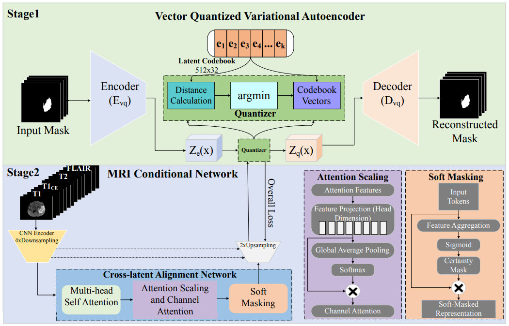

## Attention-Guided Vector Quantized Variational Autoencoder for Brain Tumor Segmentation

An Attention-Guided Vector Quantized Variational Autoencoder (AG-VQ-VAE) — a two-stage network specifically designed for boundary-focused tumor segmentation. Stage 1 comprises a VQ-VAE which learns a compact, discrete latent representation of segmentation masks. In stage 2, a conditional network extracts contextual features from MRI scans and aligns them with discrete mask embeddings to facilitate precise structural correspondence and improved segmentation fidelity.

## 🧠 Model Architecture



## 🚀 Getting Started

Follow these steps to set up and run the project.

---

### 1️⃣ Clone the Repository

```bash
git clone https://github.com/danishali6421/AG-VQVAE-MICCAI.git
cd AG-VQVAE-MICCAI
```


### 2️⃣ Set Up Environment (Custom Name)

Create the environment with a name of your choice (e.g., `vqvae_env`):

```bash
conda env create -f environment.yml -n vqvae_env
conda activate vqvae_env
```

### 3️⃣ Train the Model

Use the following command inside your `run.sh` to train either **Stage 1** (VQ-VAE) or **Stage 2** (Conditional Network). You will manually **modify the variables** depending on which stage you're training.

```bash
STAGE 1 Training
python main.py \
    --data_path $DATA_PATH \
    --modalities $MODALITIES \
    --crop_size $CROP_SIZE \
    --batch_size $BATCH_SIZE \
    --num_workers $NUM_WORKERS \
    --checkpoint_dir $CHECKPOINT_DIR \
    $VQVAE \
    $VQVAETRAINING \
    #$RESUME
STAGE2 Training
python main.py \
    --data_path $DATA_PATH \
    --modalities $MODALITIES \
    --crop_size $CROP_SIZE \
    --batch_size $BATCH_SIZE \
    --num_workers $NUM_WORKERS \
    --checkpoint_dir $CHECKPOINT_DIR \
    $COND \
    $CONDTRAINING \
    #$RESUME
```
```


```
### 4️⃣ Run Inference

Once all **three VQ-VAE modules** and their corresponding **three conditional segmentation networks** have been trained for each tumor region (e.g., WT, TC, ET), you can perform inference using the trained conditional networks.

---

### 🛠️ Modify `run.sh` for Inference

In your `run.sh`, configure the variables as follows:

```bash
python main.py \
    --data_path $DATA_PATH \
    --modalities $MODALITIES \
    --crop_size $CROP_SIZE \
    --batch_size $BATCH_SIZE \
    --num_workers $NUM_WORKERS \
    --checkpoint_dir $CHECKPOINT_DIR \
    $COND \


